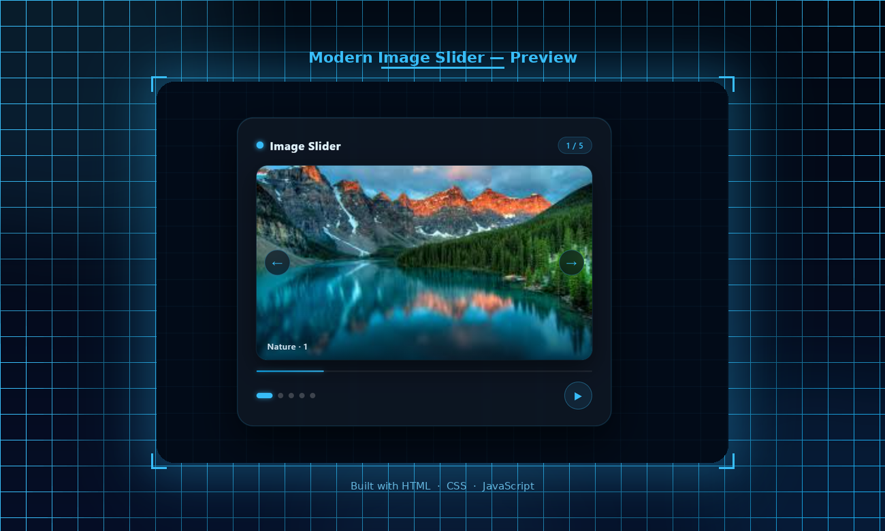

# 🖼️ Modern Image Slider

A sleek, animated image slider built with pure **HTML**, **CSS**, and **JavaScript** — no frameworks, no dependencies. Features a dark techy aesthetic with cyan accents, smooth slide transitions, and keyboard navigation.

---

## 🖼️ Preview



---

## ✨ Features

- ⬅️ Prev / Next arrow buttons on the image itself
- ▶️ Auto-play / Pause toggle with 2.8s interval
- 🔵 Clickable dot indicators with active pill animation
- 📊 Glowing progress bar that fills with each slide
- 🔢 Slide counter badge (e.g. 1 / 5)
- 🏷️ Image label overlay on each slide
- ⌨️ Keyboard navigation — Arrow keys + Spacebar
- 🎨 Smooth slide-in animations (left / right direction-aware)
- 🌐 Animated grid background with corner bracket accents

---

## 📁 Project Structure

```
ImageSlider/
├── index.html          # Markup & structure
├── style.css           # All animations & styling
├── app.js              # Slider logic & keyboard support
├── preview.png         # Screenshot for README
├── 1.jpg               # Your slide images
├── 2.jpg
├── 3.jpg
├── 4.jpg
└── 5.jpg
```

---

## 🚀 Getting Started

1. **Clone the repo**
   ```bash
   git clone https://github.com/your-username/image-slider.git
   cd image-slider
   ```

2. **Add your images**
   Place your images in the same folder and name them `1.jpg`, `2.jpg` ... `5.jpg`

3. **Open in browser**
   ```bash
   # No build step needed — just open directly
   open index.html
   ```

---

## ⌨️ Keyboard Shortcuts

| Key | Action |
|-----|--------|
| `→` Arrow Right | Next slide |
| `←` Arrow Left  | Previous slide |
| `Space`         | Play / Pause auto-slide |

---

## 🛠️ Customization

### Add or change images
In `app.js`, update the `images` array:

```js
const images = [
  { src: "1.jpg", label: "Your Label · 1" },
  { src: "2.jpg", label: "Your Label · 2" },
  // Add as many as you want
];
```

### Use online images (no download needed)
```js
const images = [
  { src: "https://images.unsplash.com/photo-xxx?w=600", label: "Mountains · 1" },
];
```

### Change auto-play speed
In `app.js`, find the `setInterval` call and change `2800` to your preferred milliseconds:
```js
timer = setInterval(() => go(1), 2800); // 2800ms = 2.8 seconds
```

### Change accent color
In `style.css`, replace `#38bdf8` with your preferred color:
```css
/* Example: change to green */
.title-dot  { background: #22c55e; }
.dot.active { background: #22c55e; }
.counter    { color: #22c55e; }
```

---

## 🎬 Animations Used

| Animation | Effect |
|-----------|--------|
| `slideInRight` | Image flies in from the right on Next |
| `slideInLeft`  | Image flies in from the left on Prev |
| `scaleIn`      | Image scales in on initial load |
| `fadeUp`       | Card slides up on page load |
| `gridMove`     | Background grid slowly drifts |
| `progressGlow` | Progress bar pulses with a cyan glow |
| `cornerPulse`  | Corner bracket accents fade in and out |

---

## 🎨 Color Palette

| Element | Color |
|---------|-------|
| Background | `#020b18` — Deep Navy |
| Accent | `#38bdf8` — Cyan Blue |
| Card border | `rgba(56, 189, 248, 0.2)` |
| Text | `#e0f2fe` — Light Blue White |

---

## 🙋‍♀️ Author

**Kaneeza Batool**  
CS Undergraduate · Sukkur, Pakistan  
Built with 💙 using HTML, CSS & JS
